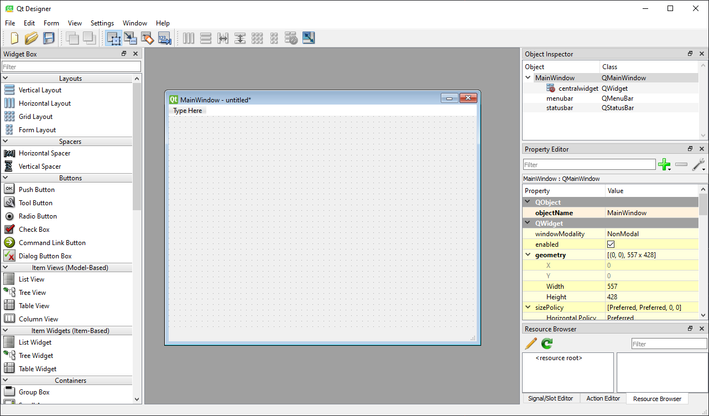

# Miért válasszuk a PyQt5-öt?

## Miért nem:
### **Tkinter**
    - Nincsen designer program hozzá, amiben könnyen és gyorsan összeállíthatnánk egy GUI-t
    - Kevés előre definiált GUI elemet tartalmaz, továbbá nincs meg bennük minden funkció, ami esetleg kellhet

### **Kivy**
    - Nincsen designer a GUI kialakitáshoz
    - Egyes rendszereken problémás telepítés

### **pysimplegui**
    - Nincsen designer a GUI kialakitáshoz
    - Másik GUI készítő könyvtárakra épül (pl. pyqt, tkinter)
    - Nevéből is származik: Minimális GUI felület: szöveg bevitel, gomb, ...

## Mi az a PyQt5?
- A PyQt5 a Qt-ból ered, ami pedig C++-hoz egy GUI készítő felületet adott, továbbá a Qt-ban egy helyen lehet programozni és tervezni is a GUI-t
- Mindenre képes, amire az előzőekben felsoroltak, hiszen régebb óta készítik
- Mivel ez a könyvtár nem egy community alapú, hanem egy olyan cég készíti akiknek az a céljuk, hogy a Qt funkciói teljes mértékben működjenek Python-ban is, így nincs hiányosság GUI elemek terén, sem a funkcionalitásukban
- Van hozzá designer, amiben meg lehet tervezni a GUI végleges formáját anélkül, hogy kódot kéne írni
- Az elemeknek a kinézetét CSS segítségével lehet teljesen testreszabni

## QtDesigner

    qtdesigner megnyitás után

- A QtDesigner egy szoftver, ami lehetővé teszi, hogy kód mentesen össze tudjunk rakni egy teljes értékű GUI-t
- A bal oldalon látható a kiválasztható GUI elemeket, amiket csak egy egyszerű drag-and-drop-pal a GUI ablakra is lehet húzni
- Középen található a GUI, ami majd a későbbiekben megjelenik a python kód lefutattásával
- Jobb oldalon pedig megtalálható, az objektum megfigyelő, itt megtekinthetjünk az összes GUI elemet, amit betettünk a GUI-nkra és ha esetleg.
- Az objektum megfigyelő alatt található az éppen kiválaszott (képen: Main Window) objektumhoz tartozó tulajdonságokat. Ezek három kategoriába vannak sorolva:
    - Általános, (majdnem) mindegyik objektumon állítható beállítások
    - Ha az adott widget egy másik widgetből származik, akkor annak a beállításai
    - A végén pedig ami az adott widget-re tartozó beállítások